# Phoca Cart BTCPay Plugin Instructions

## Index
- [Requirements](#requirements)
- [Install BTCPay Plugin](#install-btcpay-plugin)
- [Configure the Plugin](#configure-the-plugin)
- [Additional Settings](#additional-settings)
- [Troubleshooting](#troubleshooting)
- [Uninstall](#uninstall)

## Requirements
1. **PHP** version 8.0.0 or newer
2. **Joomla!** version 4 or 5 website with **Phoca Cart** version 4 or 5 installed
3. A **BTCPay Server** instance, either [self-hosted](https://docs.btcpayserver.org/Deployment/) or hosted by a [third party](https://docs.btcpayserver.org/Deployment/ThirdPartyHosting/)
   - You have a [registered account](https://docs.btcpayserver.org/RegisterAccount/) on the instance
   - You have a [store](https://docs.btcpayserver.org/CreateStore/) on the instance
   - You have a [wallet](https://docs.btcpayserver.org/WalletSetup/) connected to your store

## Install BTCPay Plugin

1. ### Download the plugin:
   Download it from GitHub.

2. ### Install the plugin:
   - From the Joomla! Administrator dashboard, select the ‘System’ menu [1], then ‘Extensions’ [2] under the ‘Install’ heading.
     
   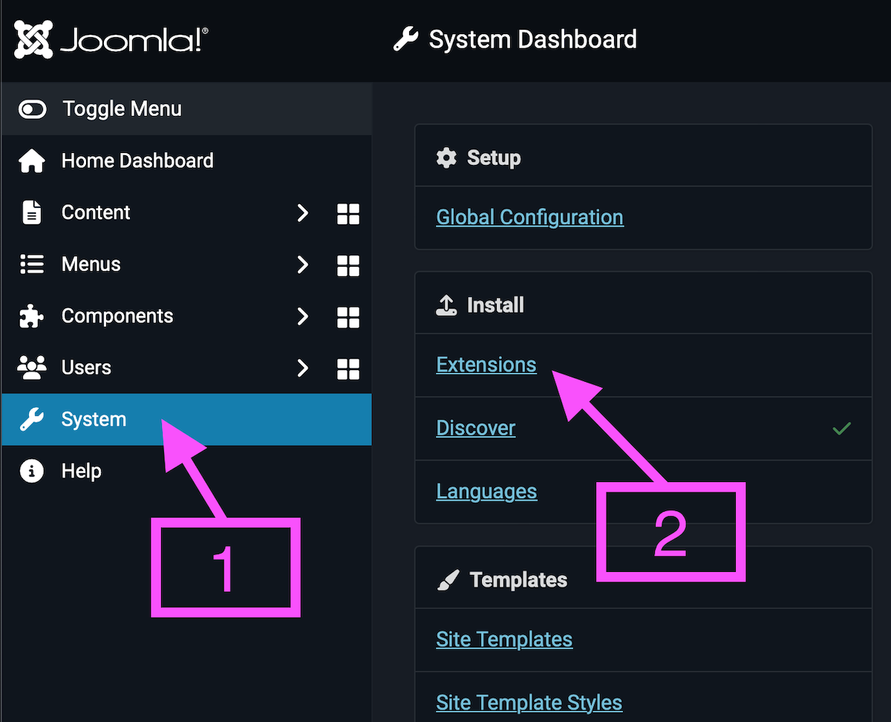
   
   - On the "Upload Package File" tab, upload the `plg_pcp_btcpay.zip` file.
     
   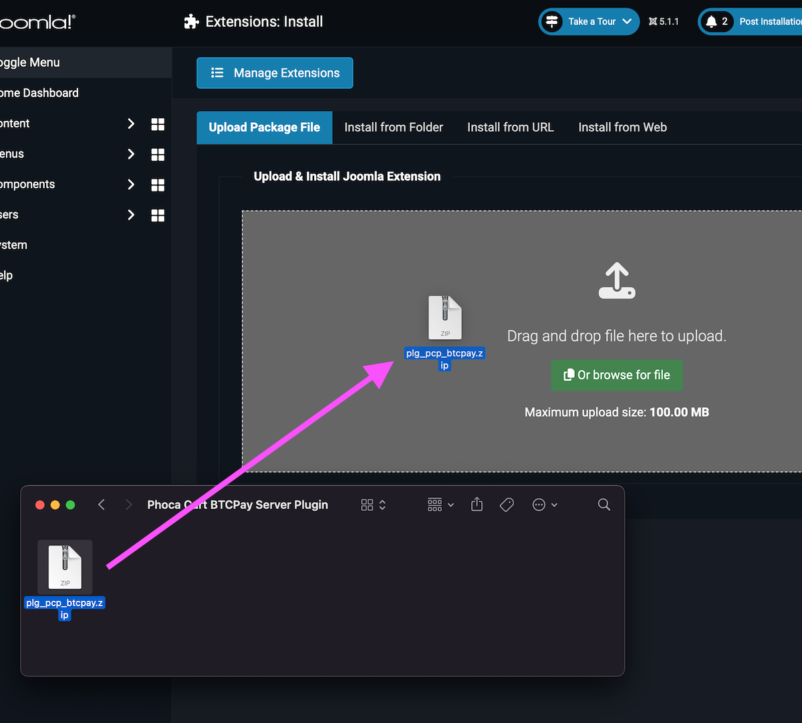

3. ### Enable the plugin:
   - After installing the plugin, select the ‘Manage Extensions’ button [1] at the top of the page.
   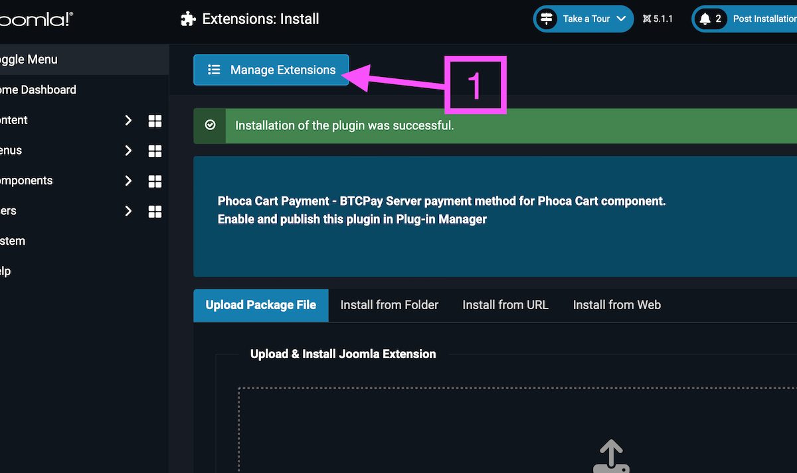
   - Alternatively, select the ‘System’ menu [1], then ‘Extensions’ [2] under the ‘Manage’ heading.
   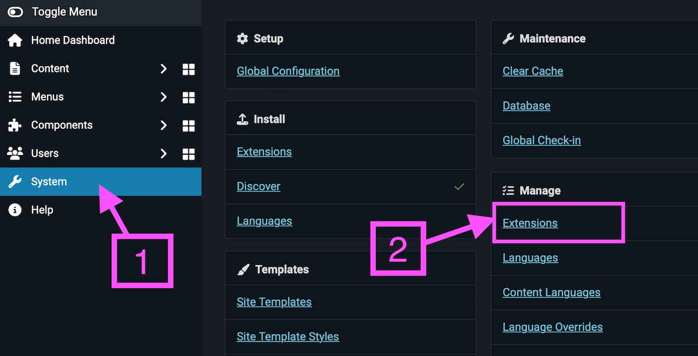
   - Enter ‘btcpay’ into the search field [1] to find the plugin, then select the enable extension icon [2] under the ‘Status’ column to enable the plugin.
   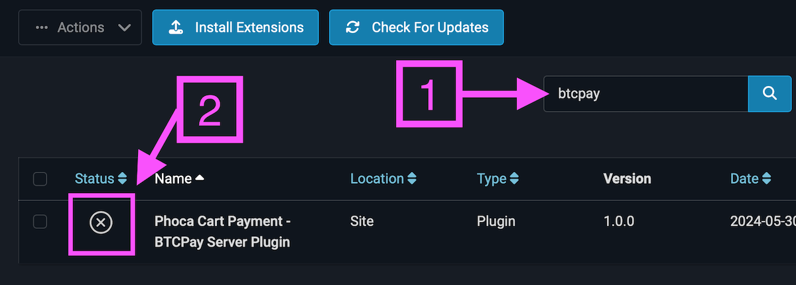

## Configure the Plugin

1. ### Publish the payment method:
   - Navigate to Phoca Cart payment methods by selecting the ‘Components’ menu [1], then ‘Phoca Cart’ [2], and then ‘Payment’ [3].
   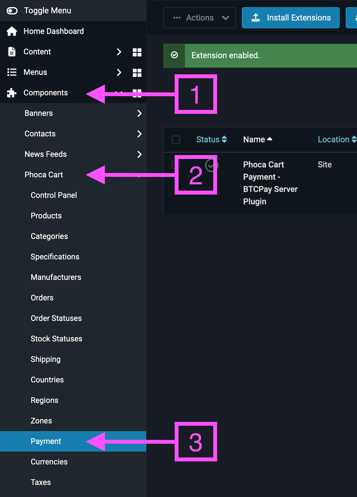
   - Select the ‘btcpay_server’ payment method. By default, it is called ‘Bitcoin and Lightning’ [1].
   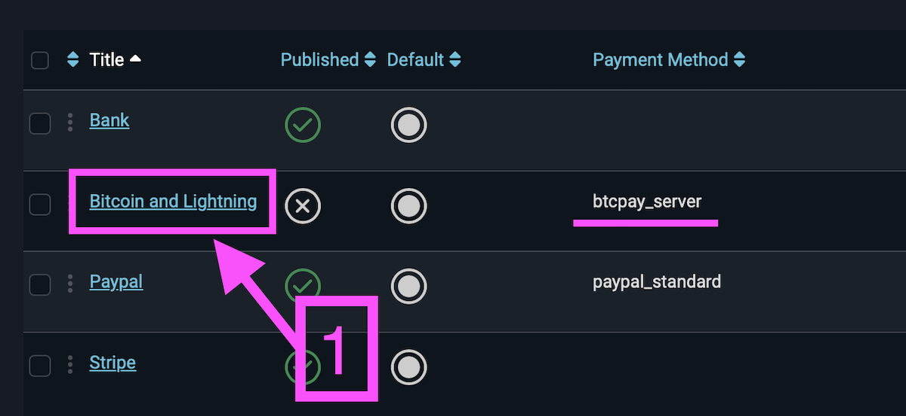
   - Publish the payment method [1], change the Title if desired [2], and then configure the plugin by selecting the ‘Payment Method Options’ tab [3].
   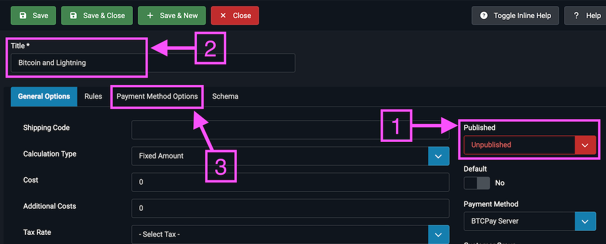

2. ### Configure the payment method:
   - Enter the URL of your BTCPay Server instance, the Store ID for the store, and the API Key.
   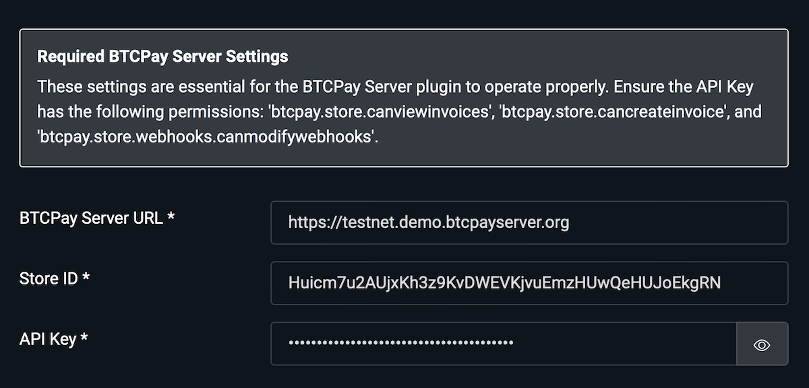
   - The Store ID can be found by selecting your store’s name [1] in BTCPay Server, then ‘Settings’ [2] and the ‘General’ tab [3]. Copy the Store ID [4] into the Store ID field in the payment plugin’s settings.
   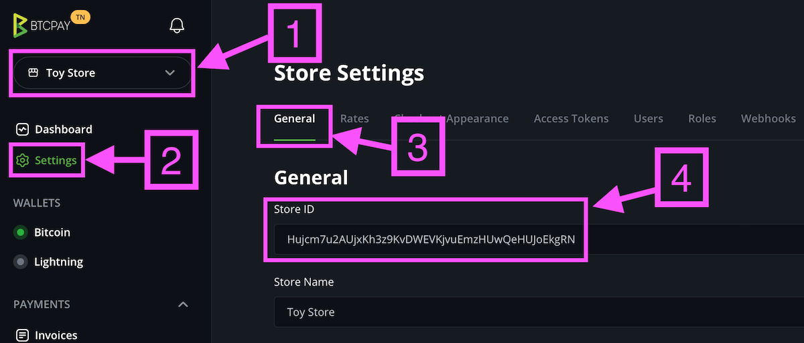
   - The API Key can be generated in BTCPay Server by selecting the ‘Account’ menu [1] at the bottom of the page and choosing ‘Manage Account’ [2].
   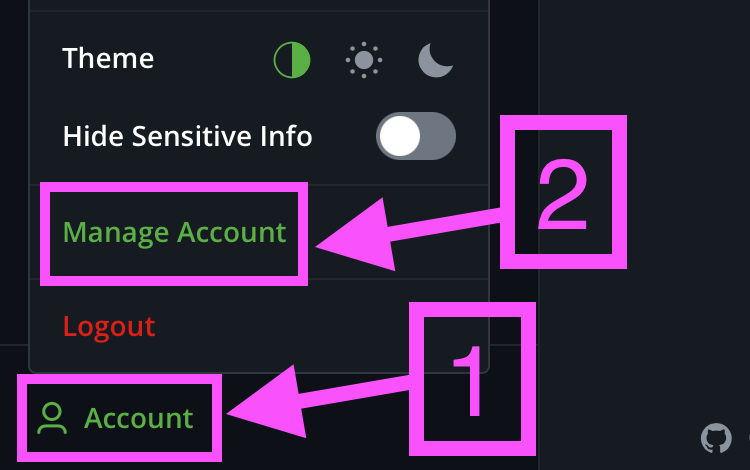
   - In ‘Account Settings’, select the ‘API Keys’ tab [1], then click the ‘Generate Key’ button [2].
   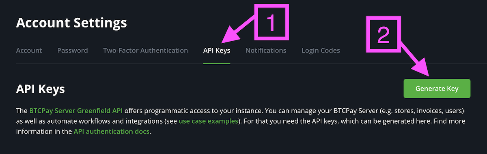
   - Enter a label [1], then select the ‘View invoices’ [2], ‘Create an invoice’ [3], and ‘Modify stores webhooks’ [4] permissions. Click the ‘Generate API Key’ button. *(If you have multiple stores set up in BTCPay Server, you can enhance security by selecting the ‘Select specific stores’ option under each of the selected permissions to limit access to the current store only.)*
   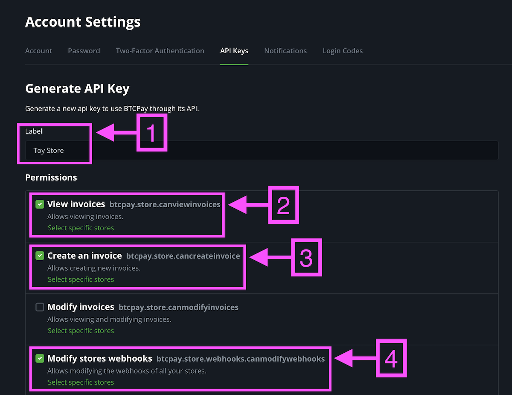
   - You will be presented with the API Key, which you should copy into the API Key field in the payment plugin’s settings.
   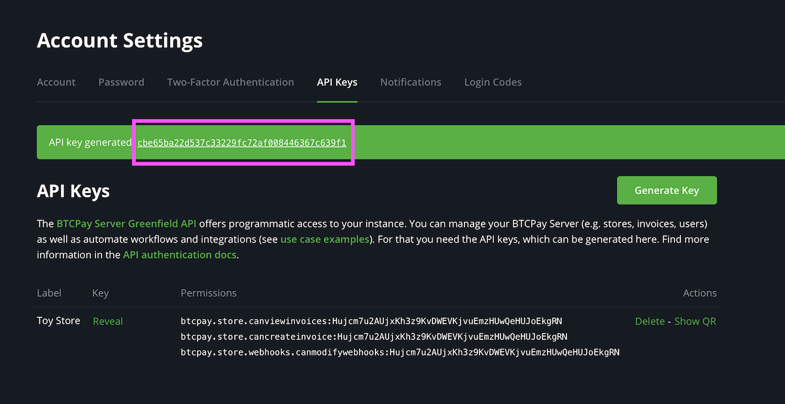

   - Add the webhook URL to BTCPay Server by clicking the ‘Add Webhook‘ button [1] in the plugin settings. This will automatically set up the webhook.
   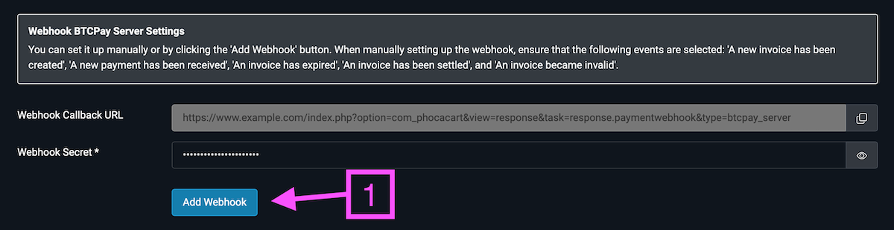

   **Manual Webhook Setup:** (Skip this step if you used the 'Add Webhook' button for automatic setup.)
   
   If you did not use the 'Add Webhook' button, follow these steps to manually set up the webhook in BTCPay Server:
   - In BTCPay Server, go to your store’s 'Settings', select the 'Webhooks' tab, and click the 'Create Webhook' button.
   - Enter the Payload URL:
     ```
     https://YOUR_JOOMLA_SITE/index.php?option=com_phocacart&view=response&task=response.paymentwebhook&type=btcpay_server
     ```
     (Replace `YOUR_JOOMLA_SITE` with your actual site domain.)
   - Enable 'Automatic redelivery'.
   - Under 'Events', select 'Send specific events' from the dropdown menu and check the following events:
     - 'A new invoice has been created'
     - 'A new payment has been received'
     - 'An invoice has expired'
     - 'An invoice has been settled'
     - 'An invoice became invalid'
   - Copy the 'Secret' generated by BTCPay Server.
   - Click the 'Add Webhook' button to save the settings.
   - Return to your plugin's settings in Joomla!, paste the 'Secret' you copied earlier into the 'Webhook Secret' field, and click 'Save' at the top of the page.

## Additional Settings

1. ### Order Statuses
   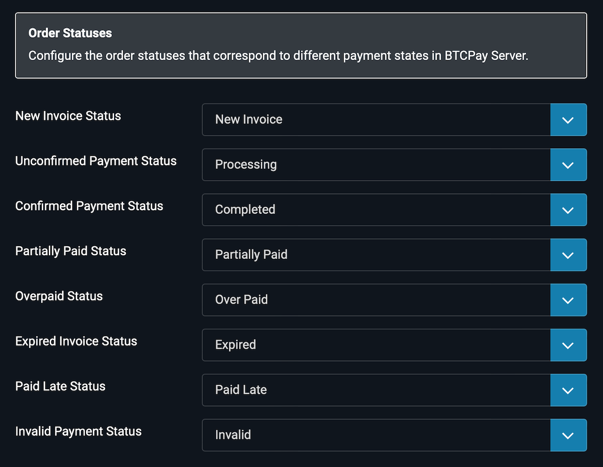
   - **New Invoice Status**: Set when a new BTCPay Server invoice is generated.
   - **Unconfirmed Payment Status**: Set when a payment has been made but not yet confirmed on the blockchain.
   - **Confirmed Payment Status**: Set when payment has been confirmed.
   - **Partially Paid Status**: Set when an order is partially paid.
   - **Overpaid Status**: Set when an order is overpaid.
   - **Expired Invoice Status**: Set when a BTCPay Server invoice expires without payment.
   - **Paid Late Status**: Set when a BTCPay Server invoice has been paid after expiry.
   - **Invalid Payment Status**: Set when a payment is invalid.

   Email messages for each order status can be edited in `Components -> Phoca Cart -> Order Statuses` under the ‘Email Options’ tab.

2. ### Invoice Data Settings
   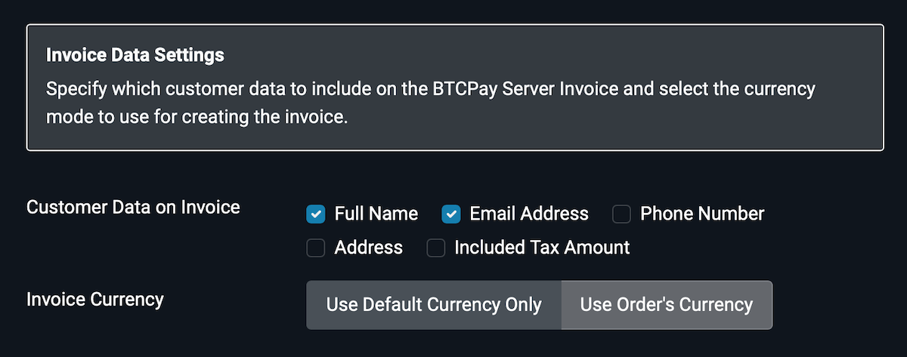
   - **Customer Data on Invoice**: Specify which customer data to include on the BTCPay Server Invoice.
   - **Invoice Currency**:
     - If your store supports multiple currencies and you select ‘Use Default Currency Only’, the BTCPay Server Invoice will always be denominated in the store’s default currency regardless of the currency selected by the client. Ensure that BTCPay Server is configured to determine the Bitcoin exchange rate for the default currency.
     - If you select ‘Use Order's Currency’, the BTCPay Server invoice will use the currency selected by the client. Ensure that BTCPay Server is configured to determine the Bitcoin exchange rate for each supported currency.

3. ### Checkout Settings
   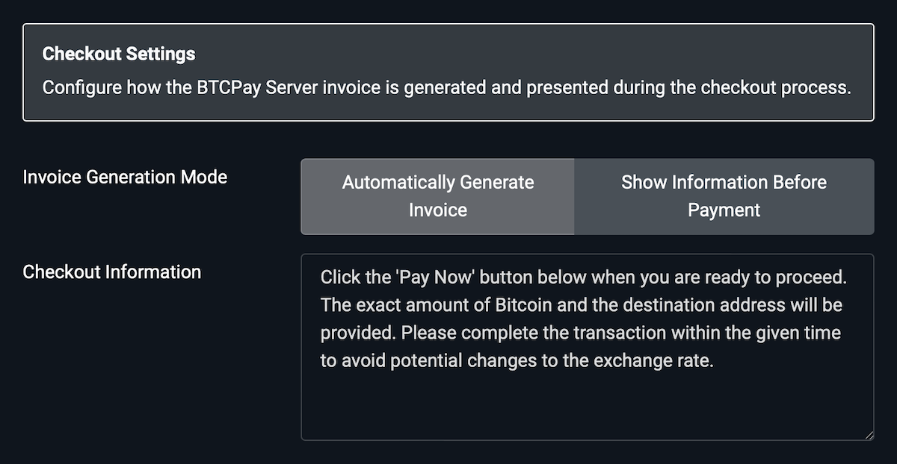
   - **Automatically Generate Invoice**: Automatically show the BTCPay Server payment popup during checkout.
   - **Show Information Before Payment**: Show additional information to the client before they have to click the “Pay Now” button to display the BTCPay Server payment popup.
     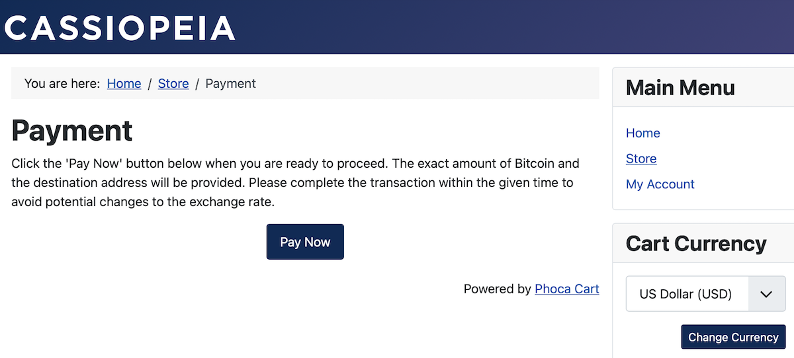

## Troubleshooting

1. ### Enable Logging for Phoca Cart
   - Go to the Joomla! administrative dashboard.
   - Select the 'System' menu, then click on 'Global Configuration' under the 'Setup' heading.
   - From the list of components, select 'Phoca Cart'.
   - In the 'Main' tab, set 'Enable Logging' to 'Yes (All)' and save the changes.

2. ### View the Log for Errors
   - Select the ‘Components’ menu, then ‘Phoca Cart’, and then ‘System Log’.
   - Enter 'btcpay' into the 'Search' field to filter and find any errors related to the BTCPay plugin.

## Uninstall

1. ### Uninstall BTCPay Plugin
   - Go to the Joomla! administrative dashboard.
   - Select the 'System' menu, then click on 'Extensions' under the 'Manage' heading.
   - Enter ‘btcpay’ into the search field to find the plugin, then check the checkbox next to it.
   - From the 'Actions' menu, select 'Uninstall'.

2. ### Remove the Payment Method
   - Navigate to Phoca Cart payment methods by selecting the ‘Components’ menu, then ‘Phoca Cart’, and then ‘Payment’.
   - Select the checkbox next to the ‘btcpay_server’ payment method. By default, it is called ‘Bitcoin and Lightning’.
   - Click the 'Delete' button.

3. ### Optional: Remove the Order Statuses
   - It is not recommended to remove the statuses because orders that used them will no longer show a status after being removed.
   - Navigate to Phoca Cart order statuses by selecting the ‘Components’ menu, then ‘Phoca Cart’, and then ‘Order Statuses’.
   - Enter ‘btcpay’ into the search field to find the order statuses used by the plugin, then check the checkboxes next to the ones you want to remove.
   - Click the 'Delete' button.

4. ### Optional: Remove the Payment Images
   - Log in to your web hosting control panel (e.g., cPanel, Plesk).
   - Open the 'File Manager' tool. This allows you to manage the files on your server.
   - Navigate to the 'images/payment' directory.
   - Locate and delete the following files:
     - `bitcoin.svg`
     - `bitcoin-lightning.svg`
